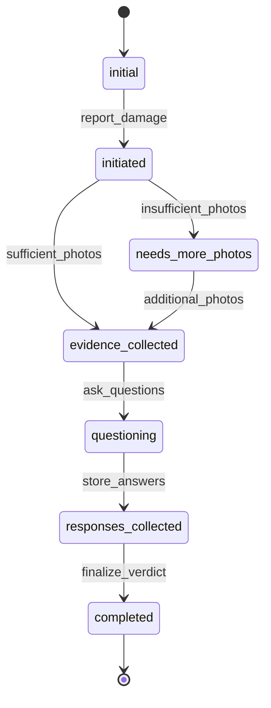

# GrabFood Dispute Resolution Agent

## Developer Guide: Context Engineering & Agent Architecture

This README explains the architectural design and prompt engineering strategies used in building GrabFood's AI-powered dispute resolution agent. The design is heavily influenced by production-tested context engineering principles for building scalable AI agents.

---

## Table of Contents
- [Architecture Overview](#architecture-overview)
- [Context Engineering Principles](#context-engineering-principles)
- [Prompt Engineering Strategies](#prompt-engineering-strategies)
- [State Management](#state-management)
- [Tool Design Philosophy](#tool-design-philosophy)
- [Development Workflow](#development-workflow)
- [Performance Optimization](#performance-optimization)

---

## Architecture Overview

### Core Components

```
┌─────────────────┐    ┌──────────────────┐    ┌─────────────────┐
│   LangGraph     │    │  DisputeContext  │    │  Vision Tools   │
│   Agent Loop    │────│  State Manager   │────│  & Evidence     │
│                 │    │                  │    │  Analysis       │
└─────────────────┘    └──────────────────┘    └─────────────────┘
         │                        │                        │
         │                        │                        │
         └────────────────────────┼────────────────────────┘
                                  │
                 ┌──────────────────────────────┐
                 │     SQLite Persistence       │
                 │   (Context + Checkpoints)    │
                 └──────────────────────────────┘
```

### Key Design Principles

1. **Context-First Architecture**: The agent's intelligence emerges from carefully engineered context rather than fine-tuned models
2. **Persistent State Management**: Full conversation state persists across sessions with automatic backup
3. **Evidence-Driven Decisions**: Multi-modal analysis (vision + NLP) drives resolution outcomes
4. **Fail-Safe Workflows**: Built-in safety checks and recovery mechanisms

---

## Context Engineering Principles

Our agent implements several context engineering strategies inspired by production AI systems:

### 1. KV-Cache Optimization

**Problem**: Agent contexts grow with each tool use, making inference expensive and slow.

**Solution**: Stable, append-only context design
```python
# ❌ Bad: Context modifications that break KV-cache
def bad_context_update(context):
    context["timestamp"] = datetime.now().isoformat()  # Changes every second!
    context["tools"] = sorted(context["tools"])        # Unstable ordering
    return context

# ✅ Good: Stable prefix, append-only updates
def good_context_update(context):
    context["tools_used"].append({               # Append only
        "tool": tool_name,
        "timestamp": datetime.now().isoformat(), # Timestamp in appendix
        "result": result
    })
    return context
```

**Key Strategies**:
- Keep system prompt stable (no timestamps in prefix)
- Use deterministic JSON serialization
- Append new information rather than modifying existing context
- Mark explicit cache breakpoints when needed

### 2. Tool Masking vs. Removal

**Problem**: Dynamic tool removal breaks KV-cache and confuses models with orphaned references.

**Solution**: Context-aware state machine with tool masking
```python
# State-based tool availability without removal
VALID_STATES = {
    "initial": ["initiate_mediation_flow"],
    "initiated": ["collect_evidence"],
    "evidence_collected": ["ask_follow_up_questions", "collect_evidence"],
    "questioning": ["store_customer_responses"],
    "responses_collected": ["finalize_verdict"],
    "completed": ["get_context_help"]
}
```

### 3. File System as Extended Context

**Philosophy**: When context windows aren't enough, use the environment as memory.

**Implementation**:
- Photos stored as base64 in tool results (not in main context)
- Evidence analysis persisted to SQLite
- Context backups prevent data loss
- Restorable compression strategies

### 4. Attention Manipulation Through Recitation

**Strategy**: Important information gets repeated at context boundaries
```python
def get_summary(self) -> str:
    """Recite current state to maintain attention"""
    return f"""
=== DISPUTE CONTEXT STATE ===
State: {self._state["state"]}
Order ID: {self._state["order_id"] or 'Not provided'}
Evidence Status: {evidence_status}
Ready for Verdict: {self.is_ready_for_verdict()}
============================="""
```

### 5. Keep Errors in Context

**Principle**: Failed actions provide valuable learning signals
```python
# Don't hide failures - they help the model learn
if needs_more_photos:
    result["photo_guidance"] = [
        "Take a closer shot of the damaged area",
        "Capture the package from different angles"
    ]
    return result  # Include the "failure" in context
```

---

## Prompt Engineering Strategies

### System Prompt Architecture

The system prompt uses a hierarchical structure optimized for agent behavior:

```
ROLE DEFINITION → CONTEXT AWARENESS → WORKFLOW LOGIC → DECISION FRAMEWORK → SPECIAL HANDLING
```

#### 1. Context-Aware Instructions
```python
**CONTEXT AWARENESS**: You have persistent context across sessions. 
Check the current state and continue appropriately.
```

#### 2. Conditional Logic Flows
```python
**EVIDENCE COLLECTION LOGIC**:
- If evidence analysis returns `needs_more_photos: true`, politely ask for additional photos
- Only proceed to questions when evidence is sufficient
```

#### 3. State-Driven Behavior
```python
**STATE-AWARE RESPONSES**:
- If state is "evidence_collected" but `needs_more_photos` is true → request more photos
- If state is "questioning" and user provides answers → store responses
```

#### 4. Decision Trees in Natural Language
```python
**DECISION FRAMEWORK**:
- SEVERE damage + product exposed = Full refund + replacement
- MODERATE damage = Replacement only  
- MINOR damage = Partial refund
- NO damage = Deny claim
```

### Prompt Engineering Techniques Used

#### A. Explicit Conditional Logic
Instead of hoping the model infers correct behavior, we specify exact conditions:
```
IF `needs_more_photos` is true → ask for additional photos and call `collect_evidence` again
ONLY when `needs_more_photos` is false AND confidence >70% → call `ask_follow_up_questions`
```

#### B. Tool Usage Constraints
Clear boundaries prevent tool misuse:
```python
def ask_follow_up_questions():
    """Only call this when evidence is sufficient (needs_more_photos = false)."""
```

#### C. Progressive Disclosure
Information is revealed as the agent progresses through states:
```python
if current_state == "initiated":
    next_actions.append("Provide photo paths or directory for evidence collection")
elif current_state == "evidence_collected":
    next_actions.append("Answer follow-up questions about the damage")
```

#### D. Safety-First Decision Making
Default to safe choices when uncertain:
```python
severity = damage.get("severity", "severe")  # Default to severe for safety
is_exposed = damage.get("is_product_exposed", True)  # Default to exposed
```

---

## State Management

### DisputeContext Class Design

The context manager implements several sophisticated patterns:

#### 1. Persistent State with Backup
```python
def _save_state(self):
    # Create backup before update
    if previous_state_exists:
        create_backup(previous_state, reason="auto_backup_before_update")
    
    # Save new state
    save_current_state()
```

#### 2. State Validation
```python
def validate_state(self) -> bool:
    required_keys = ["state", "user_role", "order_id", "evidence", "answers"]
    valid_states = ["initial", "initiated", "evidence_collected", "questioning"]
    # Validate structure and values
```

#### 3. Context Summaries for Attention
```python
def get_summary(self) -> str:
    """Generate formatted summary that appears in agent context"""
    return contextual_summary_with_next_actions()
```

### State Machine Design



---

## Tool Design Philosophy

### 1. Single Responsibility Principle
Each tool has one clear purpose:
- `initiate_mediation_flow`: Start dispute process
- `collect_evidence`: Analyze photos
- `ask_follow_up_questions`: Generate questions
- `store_customer_responses`: Record answers
- `finalize_verdict`: Make decision

### 2. Context Integration
Every tool updates the persistent context:
```python
@tool
def collect_evidence(paths: list[str] | None = None):
    # ... tool logic ...
    
    if dispute_context:
        dispute_context.add_evidence(analysis)
        dispute_context.update_state("evidence_collected")
        dispute_context.add_tool_usage("collect_evidence", args, result)
    
    return result
```

### 3. Progressive Validation
Tools validate prerequisites before execution:
```python
def ask_follow_up_questions():
    if evidence.get("needs_more_photos", True):
        return {"error": "insufficient_photos", "message": "More photos needed"}
    
    if confidence <= 0.7:
        return {"error": "low_confidence", "message": "Evidence confidence too low"}
```

### 4. Rich Error Information
Failed operations provide actionable feedback:
```python
result["photo_guidance"] = [
    "Take a closer shot of the damaged area",
    "Capture the package from different angles",
    "Ensure good lighting to see damage details clearly"
]
```

---

## Development Workflow

### 1. Context Engineering Cycle
```
Design Context Structure → Implement Tools → Test Workflows → Refine Prompts → Measure Performance
```

### 2. Testing Strategy
- **Unit Tests**: Individual tool behavior
- **Integration Tests**: Full dispute resolution workflows  
- **Context Tests**: State persistence and recovery
- **Performance Tests**: KV-cache hit rates and latency

### 3. Debugging Tools
```python
# Built-in debugging commands
"/help"      # Show current context and next actions
"/export"    # Export full context to JSON
"/validate"  # Check state integrity
"/threads"   # List all conversation threads
```

### 4. Observability
```python
# Context tracking
print(f"State transition: {old_state} → {new_state}")
print(f"Tool used: {tool_name}")
print(f"Evidence added (confidence: {confidence:.1%})")
```

---

## Performance Optimization

### 1. KV-Cache Optimization
- Stable system prompt (no timestamps)
- Append-only context updates
- Deterministic JSON serialization
- Consistent tool naming with prefixes

### 2. Context Length Management
- Evidence stored in SQLite, not main context
- Restorable compression (URLs vs. full content)
- File system as extended memory
- Structured summaries at context boundaries

### 3. Tool Selection Efficiency
- State-based tool filtering
- Consistent naming conventions for masking
- Minimal tool definitions in context

### 4. Memory Management
```python
# Efficient evidence storage
evidence_summary = {
    "confidence": 0.85,
    "needs_more_photos": False,
    "severity": "moderate"
}
# Full analysis stored in SQLite, summary in context
```

---

## Key Takeaways

### What Makes This Agent Effective

1. **Context Engineering Over Model Training**: Fast iteration cycles using prompt engineering rather than fine-tuning
2. **Persistent Memory**: Full state preservation across sessions enables complex multi-step workflows
3. **Evidence-Based Decisions**: Multi-modal analysis provides objective dispute resolution
4. **Fail-Safe Design**: Extensive validation and error recovery mechanisms
5. **Performance-Optimized**: KV-cache aware design reduces latency and costs

### Production Considerations

- **Monitoring**: Track KV-cache hit rates, context lengths, and tool success rates
- **Scaling**: SQLite works for moderate load; consider PostgreSQL for production
- **Security**: Validate all user inputs, especially file paths
- **Cost Control**: Monitor token usage and implement context compression strategies

### Future Improvements

- **Multi-Modal Evidence**: Support video analysis for complex damage cases
- **Learning**: Implement feedback loops to improve decision accuracy
- **Integration**: Connect with actual GrabFood order systems and payment APIs
- **Personalization**: Adapt communication style based on user preferences

---

## Getting Started

```bash
# Install dependencies
uv add langchain langgraph openai python-dotenv

# Set up environment
echo "OPENAI_API_KEY=your_key_here" > .env

# Run the agent
uv run main.py
```

The agent will initialize with persistent context and guide you through the dispute resolution process. Use the built-in debugging commands to understand how context engineering principles work in practice.

---

*This agent demonstrates how careful context engineering can create sophisticated AI behaviors without requiring custom model training. The principles shown here are applicable to many other AI agent use cases.*